Inference Project Report
================

> This is an example of what the inference project might look like,
> using the research workflow that started to be introduced in [Chapter
> 2](../Notes/Rethinking-Lecture-02.md). Commentary will be provided
> throughout using comment blocks like this one. As a general outline,
> the project should be composed of the following:
> 
>   - The conceptual model. Using words, describe the problem and your
>     approach to modeling the underlying, unobserved process. Note that
>     this is about domain expertise; there is no mention of any
>     specific data here beyond what the ideal data might look like.
>   - Model building. Translate the conceptual model into an actual
>     generative model using probability statements. In other words,
>     build the joint model: Specify the observational model (i.e.,
>     likelihood) and the prior(s). At this stage, to confirm that the
>     specified model aligns with your domain expertise, you should
>     simulate data from the model in a prior predictive check. If the
>     resulting simulated data aren’t reasonable, you should adjust your
>     model and repeat the process. Adjusting the model could be
>     changing the prior, the likelihood, or both. Again, there is no
>     mention of the data here beyond the domain expertise expressed in
>     the conceptual model. The point of a prior predictive check is to
>     check the general validity of your model *prior* to any specific
>     data by simulating predictions from the prior.
>   - Calibrate the model. With a generative model that properly aligns
>     with our conceptual model, we are ready for data. Here you might
>     do some exploratory data analysis to further illustrate the
>     particulars of your given data before estimating the model (i.e.,
>     fitting or calibrating or training the model on the data). Now
>     that we are working with data, we want to be sure that our model
>     is adequate. For this we perform a posterior predictive check. If
>     the resulting predictions don’t do a reasonable job of explaining
>     your data, consider adjusting the model (i.e., the likelihood,
>     prior, or both). The point of a posterior predictive check is to
>     check the validity of your model *after* (i.e., posterior) to your
>     specific data by simulating predictions from the posterior.
>   - Iterate through model building and model calibration and the
>     associated prior and posterior predictive checks, respectively, at
>     least three times, adjusting to improve your model up to and
>     including allowing for group-level differences via a hierarchical
>     model. Finally, you’ll get marginal posteriors and can evaluate
>     the results accordingly.

## Conceptual Model: Purchase Intent

Firms are always concerned with the drivers of product demand. What are
the features of a product that lead to purchase intent? This can help
inform new product design and product line optimization. Drawing from
economic theory, we can conceptualize the data generating process as
follows: Consumers get “utility” from different features of a product
such that they evaluate a product better that gives them more utility.
The ideal data would include purchase intent, product features, and some
demographic or psychographic information that we could group
observations by.

> This is an example of the simplest possible explanation. This is the
> place to record and make clear your domain expertise, so don’t hold
> back. The more nuance you have, the more you can translate into model
> building as you iterate through.

## Iteration 1: Simple Model

### Model Building

To translate the conceptual model into a generative model, we’ll start
with the simplest model first: simple regression (i.e., a Normal
likelihood and a Normal prior on the mean).

    # Likelihood.
    intent_i ∼ Normal(mu, sigma)
    
    # Priors.
    mu ∼ Normal(5, 2)
    sigma ∼ Uniform(0, 5)

Note that `intent_i` is the purchase intent for the `i`th observation,
`mu ∼ Normal(5, 2)` says the mean of `intent` will be centered around 5,
and `sigma` has to be positive.

> It’s a good idea to express the model in this form, outside of any
> code, as we started doing in [Chapter
> 4](../Notes/Rethinking-Lecture-04.md). Then we can adapt it to
> `quap()` or Stan, as appropriate.

Since it’s difficult to evaluate a joint model as separate components,
we’ll perform a prior predictive check by simulating data according to
our generative model. Note that to simulate data, we are using the
`r`andom version of the Normal (`rnorm()`) and Uniform (`runif()`)
probability distributions.

``` r
# Load packages.
library(tidyverse)
```

    ## ── Attaching packages ─────────────────────────────────────────────────────────────────────────────────────────────────────────── tidyverse 1.2.1 ──

    ## ✔ ggplot2 3.2.1     ✔ purrr   0.3.2
    ## ✔ tibble  2.1.3     ✔ dplyr   0.8.3
    ## ✔ tidyr   0.8.3     ✔ stringr 1.4.0
    ## ✔ readr   1.3.1     ✔ forcats 0.4.0

    ## ── Conflicts ────────────────────────────────────────────────────────────────────────────────────────────────────────────── tidyverse_conflicts() ──
    ## ✖ dplyr::filter() masks stats::filter()
    ## ✖ dplyr::lag()    masks stats::lag()

``` r
library(patchwork) # devtools::install_github("thomasp85/patchwork")
library(rethinking)
```

    ## Loading required package: rstan

    ## Loading required package: StanHeaders

    ## rstan (Version 2.19.2, GitRev: 2e1f913d3ca3)

    ## For execution on a local, multicore CPU with excess RAM we recommend calling
    ## options(mc.cores = parallel::detectCores()).
    ## To avoid recompilation of unchanged Stan programs, we recommend calling
    ## rstan_options(auto_write = TRUE)

    ## 
    ## Attaching package: 'rstan'

    ## The following object is masked from 'package:tidyr':
    ## 
    ##     extract

    ## Loading required package: parallel

    ## Loading required package: dagitty

    ## rethinking (Version 1.90)

    ## 
    ## Attaching package: 'rethinking'

    ## The following object is masked from 'package:purrr':
    ## 
    ##     map

``` r
library(rstan)
library(bayesplot)
```

    ## This is bayesplot version 1.7.0

    ## - Online documentation and vignettes at mc-stan.org/bayesplot

    ## - bayesplot theme set to bayesplot::theme_default()

    ##    * Does _not_ affect other ggplot2 plots

    ##    * See ?bayesplot_theme_set for details on theme setting

``` r
library(tidybayes)

options(mc.cores = parallel::detectCores()) # Allow Stan to use many cores.
rstan_options(auto_write = TRUE)            # Don't recompile Stan code that hasn't changed.

# Number of observations, set seed.
N <- 100
set.seed(42)

# Prior predictive check.
prior_pc <- tibble(
  # Simulate values of mu from its prior.
  mu = rnorm(N, mean = 5, sd = 2),
  # Simulate values of sigma from its prior.
  sigma = runif(N, min = 0, max = 5),
  # Simulate data from the prior values.
  intent = rnorm(N, mean = mu, sd = sigma)
)

# Plot the prior predictive distribution.
prior_pc %>% 
  ggplot(aes(x = intent)) +
  geom_density()
```

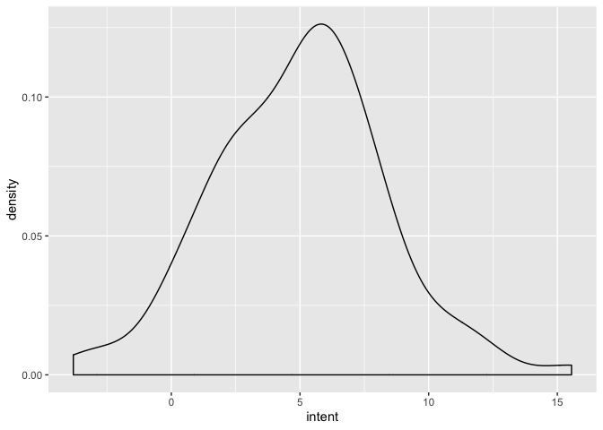<!-- -->

> What you summarize as part of your prior predictive check is going to
> be specific to your problem. Whether you look at a distribution of the
> simulated data, a distribution of regression lines resulting from the
> simulation, or something else – it doesn’t matter as long as it is
> justified and helps you evaluate how reasonable the specified model is
> prior to the data. From *Statistical Rethinking*: “By simulating from
> this \[prior predictive\] distribution, you can see what your choices
> imply about observable \[data\]. This helps you diagnose bad choices.
> Lots of conventional choices are indeed bad ones, and we’ll be able to
> see this by conducting prior predictive simulations.”

This prior predictive distribution says that purchase intent is centered
around 5, as intended, but can be as much as 15 or as low as -5. I know
that purchase intent is measured as a strictly positive continuous
value. We need to include this information in how we specify our model.
To express a tighter distribution around the mean, we need to modify the
prior on the variance term `sigma`.

    # Likelihood.
    intent_i ∼ Normal(mu, sigma)
    
    # Priors.
    mu ∼ Normal(5, 2)
    sigma ∼ Uniform(0, 1)

Note that the only change is from `sigma ∼ Uniform(0, 5)` to `sigma ∼
Uniform(0, 1)`.

``` r
# Prior predictive check.
prior_pc <- tibble(
  # Simulate values of mu from its prior.
  mu = rnorm(N, mean = 5, sd = 2),
  # Simulate values of sigma from its prior.
  sigma = runif(N, min = 0, max = 1),
  # Simulate data from the prior values.
  intent = rnorm(N, mean = mu, sd = sigma)
)

# Plot the prior predictive distribution.
prior_pc %>% 
  ggplot(aes(x = intent)) +
  geom_density()
```

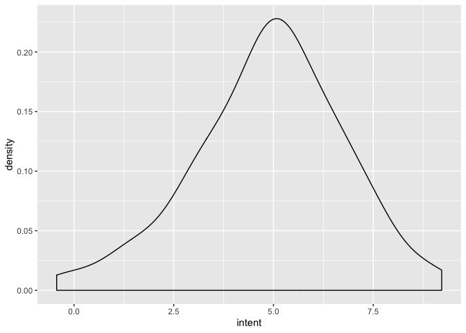<!-- -->

> “Prior predictive simulation is very useful for assigning sensible
> priors, because it can be quite hard to anticipate how priors
> influence the observable variables.” For more on selecting the prior,
> see “Rethinking: What’s the correct prior?” on page 99 of *Statistical
> Rethinking*.

Assuming we have some sort of rating scale to measure purchase intent,
this is a perfectly reasonable prior predictive distribution of the
outcome `intent`. The long tails of the Normal distribution allow for
other possibilities, but intent is centered around 5.

> Since a simple regression has a Normal likelihood, the outcome `y` is
> going to be symmetric with long tails. If that doesn’t match what we
> want to model, we need to either transform the outcome `y` so that it
> behaves like a Normal distribution (e.g., `log()` the outcome `y`),
> discretize `y` so we can work with a logistic regression, or find a
> [distribution that behaves like `y`
> does](https://mc-stan.org/docs/2_19/functions-reference/). If you want
> to do the latter, first try and work with Log-Normal distribution so
> you can still have a mean `mu` and variance `sigma`. Otherwise, you’ll
> need a link function for your non-Normal, generalized linear model
> (see *Statistical Rethinking* Chapter 10). Finally, remember that we
> are using the prior predictive check to help us decide on a model,
> especially setting priors, that is reasonable. In other words, we want
> to get in the general area that we would expect based on our domain
> expertise. For most situations, the data will be sufficiently
> informative, so much so that a great deal of caution in setting the
> prior shouldn’t matter. However, we should be cautious and go through
> the process of setting the prior carefully for those cases where it
> is.

### Model Calibration

Before we calibrate the model, let’s consider the data.

``` r
# Load the data.
load(here::here("Projects", "Data", "purchase_intent.RData"))

purchase_intent
```

    ## # A tibble: 700 x 4
    ##    intent     g brand price
    ##     <dbl> <int> <int> <dbl>
    ##  1   4.72     2     5  25.3
    ##  2   1.35     3     5  20.1
    ##  3   2.01     3     2  14.0
    ##  4   1.74     1     4  24.3
    ##  5   3.53     3     4  25.4
    ##  6   4.46     2     3  24.1
    ##  7   4.69     2     4  13.8
    ##  8   4.28     2     2  16.0
    ##  9   2.55     3     4  16.5
    ## 10   3.29     2     4  21.4
    ## # … with 690 more rows

We have the outcome `intent`, a group assignment `g`, and brand along
with `price`. So far we are only using `intent`, so let’s see what that
looks like.

``` r
purchase_intent %>% 
  ggplot(aes(intent)) +
  geom_histogram()
```

    ## `stat_bin()` using `bins = 30`. Pick better value with `binwidth`.

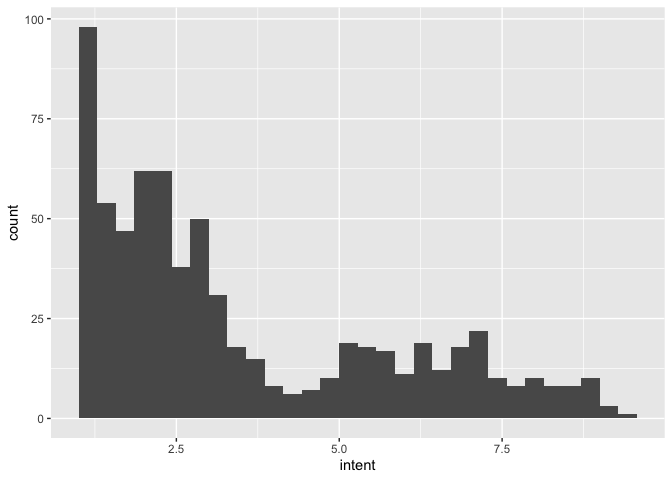<!-- -->

Across products, most people don’t intend to buy most things (i.e., rate
low on a 1 to 10 scale), producing a skew which we may or may not have
anticipated. There is also some interesting possible bimodality that
we’ll want to explore at some point.

> Exploratory data analysis can bolster our domain expertise and help us
> evaluate our model. We have to be careful to not overfit to our
> specific data set (i.e., be careful of behaviors in the data that may
> be specific to this data only).

Now let’s use `quap()` to estimate the model. Note that to estimate the
model, we are using the `d`istribution versions of the Normal
(`dnorm()`) and Uniform (`dunif()`) probability distributions.

    # Fit the model with quadratic approximation.
    model01 <- quap(
      alist(
        intent ~ dnorm(mu, sigma), # log_intent_i ∼ Normal(mu, sigma)
        mu ~ dnorm(5, 2),          # mu ∼ Normal(5, 2)
        sigma ~ dunif(0, 1)        # sigma ∼ Uniform(0, 1)
      ),
      data = purchase_intent
    )
    
    Error in quap(alist(intent ~ dnorm(mu, sigma), mu ~ dnorm(5, 2), sigma ~  : 
      non-finite finite-difference value [2]
    Start values for parameters may be too far from MAP.
    Try better priors or use explicit start values.
    If you sampled random start values, just trying again may work.
    Start values used in this attempt:
    mu = 5.27201910482745
    sigma = 0.235715229297057

An error with the estimation routine tells us that something is wrong
with our model. As part of our exploratory data analysis, we’ve
identified two features of the data that aren’t reflected in our model:
skew and bimodality. We might transform `intent` so that it isn’t as
skewed or change the likelihood to a Log-Normal. Additionally, the error
message clearly says there may be an issue with the priors. In other
words, we have options. The prior `sigma ~ dunif(0, 1)` is likely the
culprit since it’s the most constraining. After a little try and error,
we can settle on a more lenient (i.e., longer tails) version of `sigma ~
dunif(0, 3)`.

``` r
# Fit the model with quadratic approximation.
model01 <- quap(
  alist(
    intent ~ dnorm(mu, sigma), # log_intent_i ∼ Normal(mu, sigma)
    mu ~ dnorm(5, 2),          # mu ∼ Normal(5, 2)
    sigma ~ dunif(0, 3)        # sigma ∼ Uniform(0, 3)
  ),
  data = purchase_intent
)
```

> Just like we conducted a prior predictive check to make sure we were
> specifying our model in a way that resulted in reasonable predictions
> from the prior, we need to conduct a posterior predictive check to
> make sure we have specified our model in a way that results in
> reasonable predictions from the posterior. To do this, we need to use
> the entire posterior distribution, not just a summary (i.e., the
> mean).

Let’s evaluate the model using a posterior predictive check, restricting
the `x` axis with `xlim(1, 10)`.

``` r
# Extract samples from the posterior.
post01 <- extract.samples(model01)

head(post01)
```

    ##         mu    sigma
    ## 1 3.464626 2.352128
    ## 2 3.645382 2.309560
    ## 3 3.423205 2.343574
    ## 4 3.397421 2.296128
    ## 5 3.459499 2.185382
    ## 6 3.547036 2.257273

``` r
# Posterior predictive check.
post_pc01 <- tibble(
  # Simulate data from the posterior values.
  intent = rnorm(nrow(post01), mean = post01$mu, sd = post01$sigma)
)

# Plot the posterior predictive distribution.
ggplot(post_pc01, aes(x = intent)) +
  geom_histogram() +
  xlim(1, 10) +
  ggplot(purchase_intent, aes(x = intent)) +
  geom_histogram() +
  xlim(1, 10) +
  plot_layout(ncol = 1)
```

    ## `stat_bin()` using `bins = 30`. Pick better value with `binwidth`.

    ## Warning: Removed 1359 rows containing non-finite values (stat_bin).

    ## Warning: Removed 2 rows containing missing values (geom_bar).

    ## `stat_bin()` using `bins = 30`. Pick better value with `binwidth`.

    ## Warning: Removed 2 rows containing missing values (geom_bar).

<!-- -->

> While the prior predictive check resulted in a comparison with our
> domain expertise, the posterior predictive check is about comparing
> what the model would predict with our actual data. If there is a
> misalignment with what the model would predict and what we actually
> observed, there is likely a feature of the data that we’re not
> capturing well.

It is obvious in comparing the posterior predictive distribution (on the
top) and the actual `intent` data (on the bottom) that there are
features in the data that simply aren’t captured by our simple model.
Add that to what we learned from the exploratory data analysis, and it
is clear that we need to add complexity.

## Iteration 2: Including Covariates

### Model Building

> “The strategy is to make the parameter for the mean of a Gaussian
> distribution, mu, into a linear function of the predictor variable and
> other, new parameters that we invent. This strategy is often simply
> called the linear model.”

Now let’s specify a linear model by making `mu` a function of
covariates/explanatory/predictor variables.

    # Likelihood.
    intent_i ∼ Normal(mu_i, sigma)
    mu_i = alpha * brand_i + beta * price_i
    
    # Priors.
    alpha_j ∼ Normal(0, 1), for j = 1:5
    beta ~ Normal(0, 1)
    sigma ∼ Uniform(0, 3)

The improvements over the simple model should be obvious. Instead of a
single `mu`, we now have a separate `mu_i` equal to a linear combination
of the parameters `alpha` and `brand_i` and `beta` and `price_i`, the
explanatory variables in `X` associated with observation `i`. In other
words, the `i`th observation has information and potential to deviate
from the single mean.

> Note that alpha is a vector of parameters, one for each brand. Because
> of that, the combination of these parameters fill in for the intercept
> as well. It would be equivalent to have a separate intercept and then
> J-1 dummy variables coded separately. Using the index variable allows
> for us to obviate the need for a separate intercept while setting a
> single prior over the vector of parameters and getting an estimate for
> each categorical entry.

Instead of simulating data for our prior predictive check using all
`r`andom functions, we’ll make use of `quap()` to quickly get draws from
the priors. As an added benefit, since we’re using the same functions
that we’ll estimate the model with, any changes to the model
specification that cause issues with estimation will be immediately
apparent.

``` r
# Set up the model for quadratic approximation.
model02 <- quap(
  alist(
    intent ~ dnorm(mu, sigma),          # intent_i ∼ Normal(mu_i, sigma)
    mu <- alpha[brand] + beta * price,  # mu_i = alpha * brand_i + beta * price_i
    alpha[brand] ~ dnorm(0, 1),         # alpha_j ∼ Normal(0, 1), for j = 1:5
    beta ~ dnorm(0, 1),                 # beta ∼ Normal(0, 1)
    sigma ~ dunif(0, 3)                 # sigma ∼ Uniform(0, 3)
  ),
  data = purchase_intent
)

prior02 <- extract.prior(model02)           # Extract samples from the priors.
prior02$mu <- link(model02, post = prior02) # Compute mu using the link() function.

str(prior02)
```

    ## List of 4
    ##  $ beta : num [1:1000(1d)] -1.359 -1.008 0.227 -2.137 -1.395 ...
    ##  $ sigma: num [1:1000(1d)] 1.728 1.075 1.495 1.914 0.011 ...
    ##  $ alpha: num [1:1000, 1:5] -0.525 1.904 -0.274 2.384 0.705 ...
    ##  $ mu   : num [1:1000, 1:700] -34.33 -24.99 6.22 -53.61 -35.94 ...
    ##  - attr(*, "source")= chr "quap prior: 1000 samples from model02"

``` r
# Simulate data using the prior values.
prior_pc <- tibble(
  intent = rnorm(
    nrow(purchase_intent) * length(prior02$sigma), 
    mean = prior02$mu, 
    sd = prior02$sigma
  )
)

# Plot the prior predictive distribution.
prior_pc %>% 
  ggplot(aes(x = intent)) +
  geom_density()
```

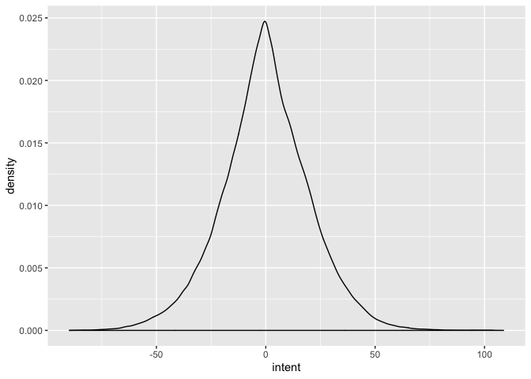<!-- -->

> The importance of a prior predictive check increases as we build a
> more complex model. When in doubt, simulate.

We’re back to a prior predictive distribution that is a mismatch. What’s
changed? We replaced `mu ∼ Normal(5, 2)` with a linear combination of
predictors with priors `alpha_j ∼ Normal(0, 1), for j = 1:5` and `beta ~
Normal(0, 1)`. With a single mean, it was easy to set the prior.
Additionally, a conventional `Normal(0, 1)` prior would appear to make
sense for the effects of brand and price, since we don’t know if the
effect is positive or negative. However, the impact of convention was
initially non-obvious. After some trial and error, we arrive at:

    # Likelihood.
    intent_i ∼ Normal(mu_i, sigma)
    mu_i = alpha * brand_i + beta * price_i
    
    # Priors.
    alpha_j ∼ Normal(0.2, 0.1), for j = 1:5
    beta ~ Normal(0.2, 0.1)
    sigma ∼ Uniform(0, 3)

Note that the priors for `alpha[brand]` and `beta` are the same. A
priori, we don’t have any reason to believe these effect sizes will be
different.

``` r
# Set up the model for quadratic approximation.
model02 <- quap(
  alist(
    intent ~ dnorm(mu, sigma),          # intent_i ∼ Normal(mu_i, sigma)
    mu <- alpha[brand] + beta * price,  # mu_i = alpha * brand_i + beta * price_i
    alpha[brand] ~ dnorm(0.2, 0.1),     # alpha_j ∼ Normal(0.2, 0.1), for j = 1:5
    beta ~ dnorm(0.2, 0.1),             # beta ∼ Normal(0.2, 0.1)
    sigma ~ dunif(0, 3)                 # sigma ∼ Uniform(0, 3)
  ),
  data = purchase_intent
)

prior02 <- extract.prior(model02)           # Extract samples from the priors.
prior02$mu <- link(model02, post = prior02) # Compute mu using the link() function.

str(prior02)
```

    ## List of 4
    ##  $ beta : num [1:1000(1d)] 0.225 0.322 0.125 0.189 0.115 ...
    ##  $ sigma: num [1:1000(1d)] 1.95 2.43 2.88 2.87 2.87 ...
    ##  $ alpha: num [1:1000, 1:5] 0.2752 0.2225 0.2845 0.3796 0.0257 ...
    ##  $ mu   : num [1:1000, 1:700] 6.1 8.19 3.46 4.98 3.28 ...
    ##  - attr(*, "source")= chr "quap prior: 1000 samples from model02"

``` r
# Simulate data using the prior values.
prior_pc <- tibble(
  intent = rnorm(
    nrow(purchase_intent) * length(prior02$sigma), 
    mean = prior02$mu, 
    sd = prior02$sigma
  )
)

# Plot the prior predictive distribution.
prior_pc %>% 
  ggplot(aes(x = intent)) +
  geom_density()
```

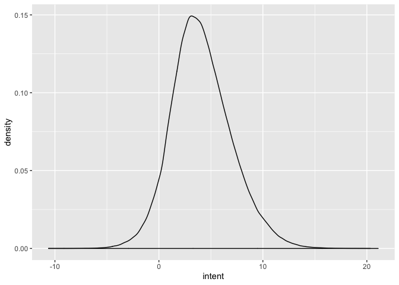<!-- -->

We have long tails (which we’ve learned is important for estimation),
but this is reasonable. Let’s go ahead and fit the model.

### Model Calibration

Since we were using `quap()` to produce the prior predictive
distribution, we’ve already run the model. Let’s evaluate, using
`link()` (as in the last prior predictive checks) to get to a posterior
predictive check. For good measure, let’s compare the previous
iteration’s posterior predictive check as
well.

``` r
post02 <- extract.samples(model02)        # Extract samples from the posterior.
post02$mu <- link(model02, post = post02) # Compute mu using the link() function.

str(post02)
```

    ## List of 4
    ##  $ beta : num [1:10000] 0.152 0.149 0.148 0.158 0.151 ...
    ##  $ sigma: num [1:10000] 2.42 2.39 2.5 2.37 2.41 ...
    ##  $ alpha: num [1:10000, 1:5] 0.217 0.1603 0.2213 0.0405 0.1284 ...
    ##  $ mu   : num [1:10000, 1:700] 4.1 3.92 3.98 4.09 4.11 ...
    ##  - attr(*, "source")= chr "quap posterior: 10000 samples from model02"

``` r
# Posterior predictive check.
post_pc02 <- tibble(
  # Simulate data from the posterior values.
  intent = rnorm(length(post02$mu), mean = post02$mu, sd = post02$sigma)
)

# Plot the posterior predictive distribution.
ggplot(post_pc01, aes(x = intent)) +
  geom_histogram() +
  xlim(1, 10) +
  ggplot(post_pc02, aes(x = intent)) +
  geom_histogram() +
  xlim(1, 10) +
  ggplot(purchase_intent, aes(x = intent)) +
  geom_histogram() +
  xlim(1, 10) +
  plot_layout(ncol = 1)
```

    ## `stat_bin()` using `bins = 30`. Pick better value with `binwidth`.

    ## Warning: Removed 1359 rows containing non-finite values (stat_bin).

    ## Warning: Removed 2 rows containing missing values (geom_bar).

    ## `stat_bin()` using `bins = 30`. Pick better value with `binwidth`.

    ## Warning: Removed 1398435 rows containing non-finite values (stat_bin).
    
    ## Warning: Removed 2 rows containing missing values (geom_bar).

    ## `stat_bin()` using `bins = 30`. Pick better value with `binwidth`.

    ## Warning: Removed 2 rows containing missing values (geom_bar).

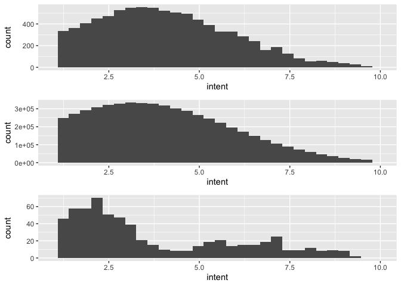<!-- -->

Adding covariates to the model hasn’t done a lot to capture the unique
structure we’re observing in terms of the apparent bimodality, as we
move from the posterior predictive distribution from the first model
(top) to the posterior predictive distribution form the second model
(middle) to the observed data (bottom). For the final iteration, let’s
add more complexity still by using the hierarchical structure in the
data.

## Iteration 3: Including a Hierarchical Structure

### Model Building

> Building a model directly in Stan can be a little daunting. However,
> it allows us the most flexibility. We only briefly covered `ulam()`,
> which follows the exact same syntax as `quap()`, but you can use it to
> help you figure out what to write in Stan since it actually writes
> Stan code for you. There are packages similar to `rethinking` that
> similarly write Stan code for you. They aren’t general purpose
> solutions, but they can be a helpful place to start.
> 
> For example, let’s start with the model we just ran. All I’ve done is
> changed `quap()` to `ulam()`

    model02 <- ulam(
      alist(
        intent ~ dnorm(mu, sigma),          # intent_i ∼ Normal(mu_i, sigma)
        mu <- alpha[brand] + beta * price,  # mu_i = alpha * brand_i + beta * price_i
        alpha[brand] ~ dnorm(0.2, 0.1),     # alpha_j ∼ Normal(0.2, 0.1), for j = 1:5
        beta ~ dnorm(0.2, 0.1),             # beta ∼ Normal(0.2, 0.1)
        sigma ~ dunif(0, 3)                 # sigma ∼ Uniform(0, 3)
      ),
      data = purchase_intent
    )

> Once it finishes running, we can look at the Stan code that was
> written for you with:
> 
> `stancode(model02)`

    data{
        int g[700];
        vector[700] intent;
        vector[700] price;
        int brand[700];
    }
    parameters{
        vector[5] alpha;
        real beta;
        real<lower=0,upper=3> sigma;
    }
    model{
        vector[700] mu;
        sigma ~ uniform( 0 , 3 );
        beta ~ normal( 0.2 , 0.1 );
        alpha ~ normal( 0.2 , 0.1 );
        for ( i in 1:700 ) {
            mu[i] = alpha[brand[i]] + beta * price[i];
        }
        intent ~ normal( mu , sigma );
    }

> The number of observations is hard-coded, and some of the spacing
> follows McElreath’s strange formatting, but otherwise it provides a
> helpful sketch of where to start.

Our data include group-level information – segments in this case.

``` r
purchase_intent %>% 
  group_by(g) %>% 
  summarize(avg_intent = mean(intent))
```

    ## # A tibble: 3 x 2
    ##       g avg_intent
    ##   <int>      <dbl>
    ## 1     1       1.81
    ## 2     2       6.42
    ## 3     3       2.32

And the segments clearly matter when it comes to purchase intent. So
let’s include this hierarchical structure in our model.

    # Observation model.
    intent_n ∼ Normal(mu_n, sigma)
    mu_n = alpha[g[n],] * brand_n + beta[g[n]] * price_n
    
    # Population model.
    alpha ∼ Normal(gamma, tau), for k = 1:3 and i = 1:5
    beta ~ Normal(gamma, tau), for k = 1:3
    
    # Hyperpriors and prior.
    gamma ∼ Normal(0.2, 0.1)
    tau ~ Uniform(0, 3)
    sigma ∼ Uniform(0, 3)

Note the following changes to the model:

  - Notation has changed, where the `i`th observation is now the `n`th
    observation and the `j`th brand is now the `i`th covariate.
  - Instead of a single set of parameters `alpha` for brand or a single
    parameter `beta` for price, we now have a matrix of `alpha`
    parameters, one row of parameters for each group `k`, and a vector
    of price `k` parameters.
  - We still have our observation model plus an additional population
    model and the associate priors and hyperpriors (priors on priors).

More than ever, we will be dependent on our prior predictive check to
make sense of the impact of various model specifications. Like before,
we’ll make use of the same code we use for estimation to quickly get
draws from the priors. However, with the number of parameters increasing
substantially, `quap()` will no longer be sufficient. It’s time for
Stan.

Let’s first set the `data` block.

``` stan
// Index values, observations, and covariates.
data {
  int<lower = 1> N;                      // Number of observations.
  int<lower = 1> K;                      // Number of groups.
  int<lower = 1> I;                      // Number of observation-level covariates.
  
  real intent[N];                        // Vector of observations.
  int<lower = 1, upper = K> g[N];        // Vector of group assignments.
  int brand[N];                          // Vector of brands covariates.
  vector[N] price;                       // Vector of price covariates.
  
  real gamma_mean;                       // Mean for the hyperprior on gamma.
  real<lower = 0> gamma_var;             // Variance for the hyperprior on gamma.
  real<lower = 0> tau_min;               // Minimum for the hyperprior on tau.
  real<lower = 0> tau_max;               // Maximum for the hyperprior on tau.
  real<lower = 0> sigma_min;             // Minimum for the hyperprior on tau.
  real<lower = 0> sigma_max;             // Maximum for the hyperprior on tau.
}
```

Note the following:

  - `intent` is constrained to be from 1 to 10, effectively truncating
    our Normal likelihood.
  - `brand` and `price` are separate vectors, with `brand` explicitly
    composed of `int`eger values so we can continue to treat it as an
    index variable rather than dummy variables with a separate
    intercept.

> If instead of an index variable you have a matrix of observation-level
> covariates, `X`, be sure it includes an intercept (i.e., a column of
> ones).

  - We have specified the hyperprior values as part of the `data` input
    to make it easy to try different values without having to modify and
    thus recompile the Stan code.

> See the Stan option `rstan_options(auto_write = TRUE)` set after
> loading packages.

Now the `parameter` block.

``` stan
// Parameters and hyperparameters.
parameters {
  matrix[K, (I - 1)] alpha;              // Matrix of observation-level brand coefficients.
  vector[K] beta;                        // Vector of observation-level price coefficients.
  real gamma;                            // Mean of the population model.
  real<lower=0> tau;                     // Variance of the population model.
  real<lower=0> sigma;                   // Variance of the observation model.
}
```

Note that `alpha` is a `K x (I - 1)` matrix since `I` is the total
number of covariates (including the implicit intercept in the index
variable) and `price` has it’s own vector of parameter values,
consistent with how we parameterized the model in the previous
iteration.

Now the `model` block.

``` stan
// Hierarchical regression.
model {
  // Declare mu for use in the linear model.
  vector[N] mu;
  
  // Hyperpriors and prior.
  gamma ~ normal(gamma_mean, gamma_var);
  tau ~ uniform(tau_min, tau_max);
  sigma ~ uniform(sigma_min, sigma_max);

  // Population model and likelihood.
  for (k in 1:K) {
    alpha[k,] ~ normal(gamma, tau);
    beta[k] ~ normal(gamma, tau);
  }
  for (n in 1:N) {
    mu[n] = alpha[g[n], brand[n]] + beta[g[n]] * price[n];
  }
  intent ~ normal(mu, sigma);
}
```

Finally, since we’ll want to create a posterior predictive check, we
produce predictions as part of estimating the model with a `generated
quantities` block.

``` stan
// Generate predictions using the posterior.
generated quantities {
  vector[N] mu_pc;                       // Declare mu for predicted linear model.
  real intent_pc[N];                     // Vector of predicted observations.

  // Generate posterior prediction distribution.
  for (n in 1:N) {
    mu_pc[n] = alpha[g[n], brand[n]] + beta[g[n]] * price[n];
    intent_pc[n] = normal_rng(mu_pc[n], sigma);
  }
}
```

This is all saved as `hierarchical_model.stan`, translated into
`generate_data.stan` as follows:

``` stan
// Index values, observations, covariates, and hyperior values.
data {
  int<lower = 1> N;                      // Number of observations.
  int<lower = 1> K;                      // Number of groups.
  int<lower = 1> I;                      // Number of observation-level covariates.
  
  int<lower = 1, upper = K> g[N];        // Vector of group assignments.
  int brand[N];                          // Vector of brands covariates.
  vector[N] price;                       // Vector of price covariates.
  
  real gamma_mean;                       // Mean for the hyperprior on gamma.
  real<lower = 0> gamma_var;             // Variance for the hyperprior on gamma.
  real<lower = 0> tau_min;               // Minimum for the hyperprior on tau.
  real<lower = 0> tau_max;               // Maximum for the hyperprior on tau.
  real<lower = 0> sigma_min;             // Minimum for the hyperprior on tau.
  real<lower = 0> sigma_max;             // Maximum for the hyperprior on tau.
}

// Generate data according to the hierarchical regression.
generated quantities {
  matrix[K, (I - 1)] alpha;              // Matrix of observation-level brand coefficients.
  vector[K] beta;                        // Vector of observation-level price coefficients.
  real gamma;                            // Mean of the population model.
  real<lower=0> tau;                     // Variance of the population model.
  real<lower=0> sigma;                   // Variance of the observation model.
  
  vector[N] mu;                          // Declare mu for linear model.
  real intent[N];                        // Vector of observations.

  gamma = normal_rng(gamma_mean, gamma_var);
  tau = uniform_rng(tau_min, tau_max);
  sigma = uniform_rng(sigma_min, sigma_max);

  // Draw parameter values and generate data.
  for (k in 1:K) {
    for (i in 1:(I - 1)) {
      alpha[k, i] = normal_rng(gamma, tau);
    }
    beta[k] = normal_rng(gamma, tau);
  }
  for (n in 1:N) {
    mu[n] = alpha[g[n], brand[n]] + beta[g[n]] * price[n];
    intent[n] = normal_rng(mu[n], sigma);
  }
}
```

Note that all models are `=` instead of `~` and the distributions end in
`_rng` in order to generate data.

That’s a lot of setup – let’s produce a prior predictive check\!

``` r
# Specify values to simulate data.
sim_values <- list(
  N = 100,                                       # Number of observations.
  K = 3,                                         # Number of groups.
  I = 5,                                         # Number of observation-level covariates.
  
  g = sample(3, 100, replace = TRUE),            # Vector of group assignments.
  brand = as.integer(round(runif(N, 1, 5 - 1))), # Vector of brands covariates.
  price = round(runif(N, 10, 30), 2),            # Vector of price covariates.
  
  gamma_mean = 0.2,                              # Mean for the hyperprior on gamma.
  gamma_var = 0.1,                               # Variance for the hyperprior on gamma.
  tau_min = 0,                                   # Minimum for the hyperprior on tau.
  tau_max = 3,                                   # Maximum for the hyperprior on tau.
  sigma_min = 0,                                 # Minimum for the hyperprior on tau.
  sigma_max = 3                                  # Maximum for the hyperprior on tau.
)

# Generate data.
sim_data <- stan(
  file = here::here("Projects", "Code", "generate_data.stan"),
  data = sim_values,
  iter = 10,
  chains = 1,
  seed = 42,
  algorithm = "Fixed_param"
)
```

    ## 
    ## SAMPLING FOR MODEL 'generate_data' NOW (CHAIN 1).
    ## Chain 1: Iteration: 1 / 10 [ 10%]  (Sampling)
    ## Chain 1: Iteration: 2 / 10 [ 20%]  (Sampling)
    ## Chain 1: Iteration: 3 / 10 [ 30%]  (Sampling)
    ## Chain 1: Iteration: 4 / 10 [ 40%]  (Sampling)
    ## Chain 1: Iteration: 5 / 10 [ 50%]  (Sampling)
    ## Chain 1: Iteration: 6 / 10 [ 60%]  (Sampling)
    ## Chain 1: Iteration: 7 / 10 [ 70%]  (Sampling)
    ## Chain 1: Iteration: 8 / 10 [ 80%]  (Sampling)
    ## Chain 1: Iteration: 9 / 10 [ 90%]  (Sampling)
    ## Chain 1: Iteration: 10 / 10 [100%]  (Sampling)
    ## Chain 1: 
    ## Chain 1:  Elapsed Time: 0 seconds (Warm-up)
    ## Chain 1:                0.000176 seconds (Sampling)
    ## Chain 1:                0.000176 seconds (Total)
    ## Chain 1:

``` r
# Extract the simulated data.
prior_pc <- tibble(
  intent = as.vector(extract(sim_data)$intent)
)

# Plot the prior predictive distribution.
prior_pc %>% 
  ggplot(aes(x = intent)) +
  geom_density()
```

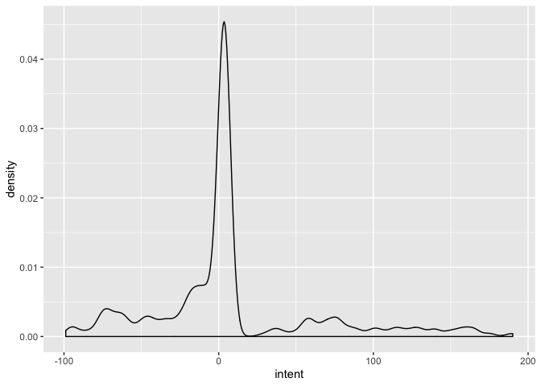<!-- -->

Two things to note. One, setting priors for hierarchical model is
non-obvious. Second, allowing for group-level differences drastically
changes our predictions since we have `K` times as many parameters as
before.

Since we have specified the hyperprior values as part of the input, it
is easy to try different values without having to modify and thus
recompile the Stan code. After some trial and error, we arrive at:

    # Observation model.
    intent_n ∼ Normal(mu_n, sigma)
    mu_n = alpha[g[n],] * brand_n + beta[g[n]] * price_n
    
    # Population model.
    alpha ∼ Normal(gamma, tau), for k = 1:3 and i = 1:5
    beta ~ Normal(gamma, tau), for k = 1:3
    
    # Hyperpriors and prior.
    gamma ∼ Normal(0, 1)
    tau ~ Uniform(0, 3)
    sigma ∼ Uniform(0, 3)

Note that we’ve arrived back at a more reasonable prior `gamma ∼
Normal(0, 1)`. Because the observation-level `alpha` and `beta`
parameters are now group-level specific, we have more flexibility
inherently and don’t need to tune the hyperprior values to get
reasonable prior predictive distributions.

``` r
# Specify values to simulate data.
sim_values <- list(
  N = 100,                                       # Number of observations.
  K = 3,                                         # Number of groups.
  I = 5,                                         # Number of observation-level covariates.
  
  g = sample(3, 100, replace = TRUE),            # Vector of group assignments.
  brand = as.integer(round(runif(N, 1, 5 - 1))), # Vector of brands covariates.
  price = round(runif(N, 10, 30), 2),            # Vector of price covariates.
  
  gamma_mean = 0,                                # Mean for the hyperprior on gamma.
  gamma_var = 1,                                 # Variance for the hyperprior on gamma.
  tau_min = 0,                                   # Minimum for the hyperprior on tau.
  tau_max = 3,                                   # Maximum for the hyperprior on tau.
  sigma_min = 0,                                 # Minimum for the hyperprior on tau.
  sigma_max = 3                                  # Maximum for the hyperprior on tau.
)

# Generate data.
sim_data <- stan(
  file = here::here("Projects", "Code", "generate_data.stan"),
  data = sim_values,
  iter = 10,
  chains = 1,
  seed = 42,
  algorithm = "Fixed_param"
)
```

    ## 
    ## SAMPLING FOR MODEL 'generate_data' NOW (CHAIN 1).
    ## Chain 1: Iteration: 1 / 10 [ 10%]  (Sampling)
    ## Chain 1: Iteration: 2 / 10 [ 20%]  (Sampling)
    ## Chain 1: Iteration: 3 / 10 [ 30%]  (Sampling)
    ## Chain 1: Iteration: 4 / 10 [ 40%]  (Sampling)
    ## Chain 1: Iteration: 5 / 10 [ 50%]  (Sampling)
    ## Chain 1: Iteration: 6 / 10 [ 60%]  (Sampling)
    ## Chain 1: Iteration: 7 / 10 [ 70%]  (Sampling)
    ## Chain 1: Iteration: 8 / 10 [ 80%]  (Sampling)
    ## Chain 1: Iteration: 9 / 10 [ 90%]  (Sampling)
    ## Chain 1: Iteration: 10 / 10 [100%]  (Sampling)
    ## Chain 1: 
    ## Chain 1:  Elapsed Time: 0 seconds (Warm-up)
    ## Chain 1:                0.000173 seconds (Sampling)
    ## Chain 1:                0.000173 seconds (Total)
    ## Chain 1:

``` r
# Extract the simulated data.
prior_pc <- tibble(
  intent = as.vector(extract(sim_data)$intent)
)

# Plot the prior predictive distribution.
prior_pc %>% 
  ggplot(aes(x = intent)) +
  geom_density()
```

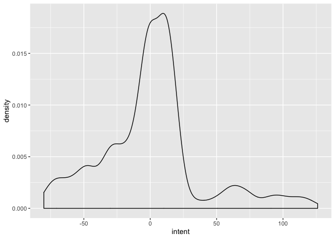<!-- -->

We’re still operating with data that probably *should* be strictly
positive. However, we’ve also seen the importance of having tails on the
prior predictive distribution. Let’s proceed with estimation.

### Model Calibration

``` r
# Specify data.
data <- list(
  N = nrow(purchase_intent),                     # Number of observations.
  K = max(purchase_intent$g),                    # Number of groups.
  I = max(purchase_intent$brand) + 1,            # Number of observation-level covariates.
  
  intent = purchase_intent$intent,               # Vector of observations.
  g = purchase_intent$g,                         # Vector of group assignments.
  brand = purchase_intent$brand,                 # Vector of brands covariates.
  price = purchase_intent$price,                 # Vector of price covariates.
  
  gamma_mean = 0,                                # Mean for the hyperprior on gamma.
  gamma_var = 1,                                 # Variance for the hyperprior on gamma.
  tau_min = 0,                                   # Minimum for the hyperprior on tau.
  tau_max = 3,                                   # Maximum for the hyperprior on tau.
  sigma_min = 0,                                 # Minimum for the hyperprior on tau.
  sigma_max = 3                                  # Maximum for the hyperprior on tau.
)

# Calibrate the model.
model03 <- stan(
  file = here::here("Projects", "Code", "hierarchical_model.stan"),
  data = data,
  control = list(adapt_delta = 0.99),
  seed = 42
)
```

    ## Warning: There were 2527 divergent transitions after warmup. Increasing adapt_delta above 0.99 may help. See
    ## http://mc-stan.org/misc/warnings.html#divergent-transitions-after-warmup

    ## Warning: There were 776 transitions after warmup that exceeded the maximum treedepth. Increase max_treedepth above 10. See
    ## http://mc-stan.org/misc/warnings.html#maximum-treedepth-exceeded

    ## Warning: There were 3 chains where the estimated Bayesian Fraction of Missing Information was low. See
    ## http://mc-stan.org/misc/warnings.html#bfmi-low

    ## Warning: Examine the pairs() plot to diagnose sampling problems

    ## Warning: The largest R-hat is 4.1, indicating chains have not mixed.
    ## Running the chains for more iterations may help. See
    ## http://mc-stan.org/misc/warnings.html#r-hat

    ## Warning: Bulk Effective Samples Size (ESS) is too low, indicating posterior means and medians may be unreliable.
    ## Running the chains for more iterations may help. See
    ## http://mc-stan.org/misc/warnings.html#bulk-ess

    ## Warning: Tail Effective Samples Size (ESS) is too low, indicating posterior variances and tail quantiles may be unreliable.
    ## Running the chains for more iterations may help. See
    ## http://mc-stan.org/misc/warnings.html#tail-ess

I’ve set `adapt_delta = 0.99` in an effort to preempt any problems with
divergent transitions.

> However, we still get divergent transitions. This is hard. I’m still
> working out a different parameterization. So let’s just ignore them
> for now.

Let’s look at the posterior predictive distribution and compare it with
our data.

``` r
# Posterior predictive check.
post_pc03 <- tibble(
  # Extract the posterior predicted values.
  intent = as.vector(extract(model03)$intent_pc)
)

# Plot the posterior predictive distribution.
ggplot(post_pc01, aes(x = intent)) +
  geom_histogram() +
  xlim(1, 10) +
  ggplot(post_pc02, aes(x = intent)) +
  geom_histogram() +
  xlim(1, 10) +
  ggplot(post_pc03, aes(x = intent)) +
  geom_histogram() +
  xlim(1, 10) +
  ggplot(purchase_intent, aes(x = intent)) +
  geom_histogram() +
  xlim(1, 10) +
  plot_layout(ncol = 1)
```

    ## `stat_bin()` using `bins = 30`. Pick better value with `binwidth`.

    ## Warning: Removed 1359 rows containing non-finite values (stat_bin).

    ## Warning: Removed 2 rows containing missing values (geom_bar).

    ## `stat_bin()` using `bins = 30`. Pick better value with `binwidth`.

    ## Warning: Removed 1398435 rows containing non-finite values (stat_bin).
    
    ## Warning: Removed 2 rows containing missing values (geom_bar).

    ## `stat_bin()` using `bins = 30`. Pick better value with `binwidth`.

    ## Warning: Removed 1457076 rows containing non-finite values (stat_bin).
    
    ## Warning: Removed 2 rows containing missing values (geom_bar).

    ## `stat_bin()` using `bins = 30`. Pick better value with `binwidth`.

    ## Warning: Removed 2 rows containing missing values (geom_bar).

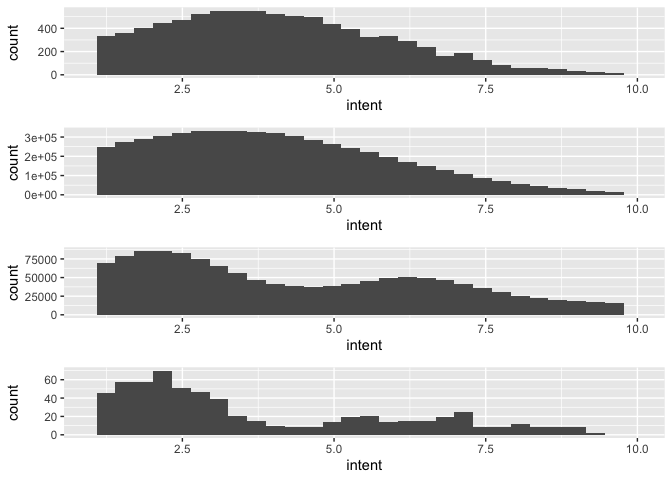<!-- -->

As before, the posterior predictive distributions are listed in order
from top to bottom, with the data the final plot. It’s clear that
allowing for a grouping structure accounts for this apparent bimodality.

Let’s evaluate the marginal posteriors.

``` r
# Plot the alphas.
model03 %>%
  gather_draws(alpha[n, i]) %>%
  unite(.variable, .variable, n, i) %>%
  ggplot(aes(x = .value, y = .variable)) +
  geom_halfeyeh(.width = .95) +
  facet_wrap(
    ~ .variable,
    nrow = data$K,
    ncol = (data$I - 1),
    scales = "free"
  )
```

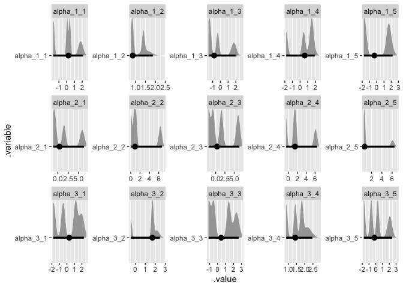<!-- -->

``` r
# Plot the betas.
model03 %>%
  gather_draws(beta[i]) %>%
  unite(.variable, .variable, i) %>%
  ggplot(aes(x = .value, y = .variable)) +
  geom_halfeyeh(.width = .95) +
  facet_wrap(
    ~ .variable,
    nrow = data$K,
    ncol = 1,
    scales = "free"
  )
```

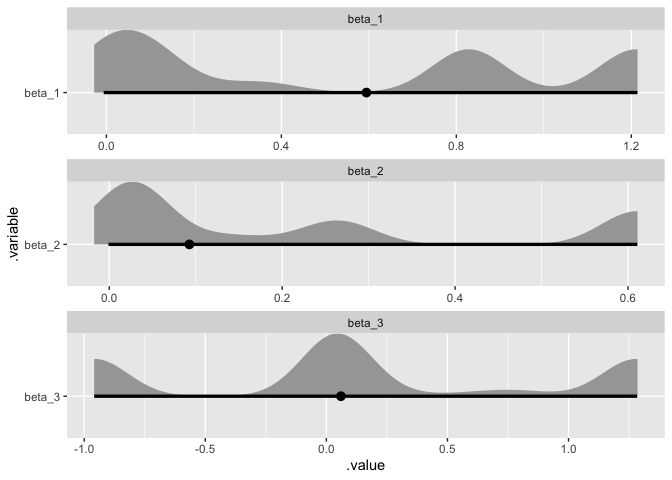<!-- -->

> Something is up with my plots, but this is where you would discuss the
> results: What do you learn about the underlying process from the
> marginal posteriors? Fin.
